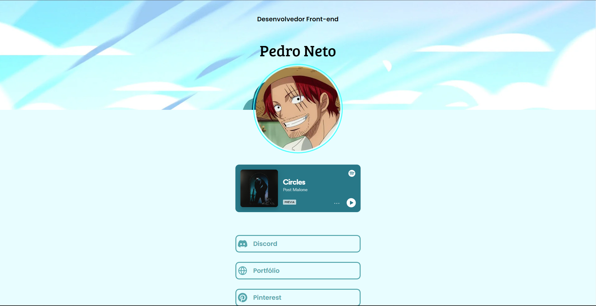

<h1 align="center"> Working Tree </h1>

Site que traz alguns sites e redes sociais que auxiliam a me encontrar e conhecer mais um pouco, fique a vontade para entrar em contato caso e/ou enviar alguma sugestão, caso deseje.

  <a href="#-tecnologias">Tecnologias</a>&nbsp;&nbsp;&nbsp;|&nbsp;&nbsp;&nbsp;
  <a href="#-projeto">Projeto</a>&nbsp;&nbsp;&nbsp;|&nbsp;&nbsp;&nbsp;
  <a href="#memo-licença">Licença</a>

  

 

  

## 🚀 Tecnologias

Esse projeto foi desenvolvido com as seguintes tecnologias:

- CSS
- JavaScript (React)
- Git e Github

## 💻 Projeto

Working Tree com algumas de minhas redes sociais e meios de contato.

## :memo: Licença

Esse projeto está sob a licença MIT.

---

Feito com ♥ by Pedro Neto :wave:
